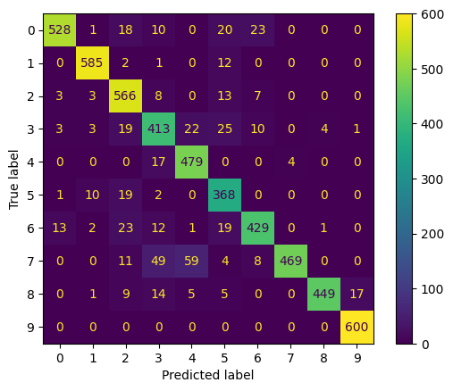
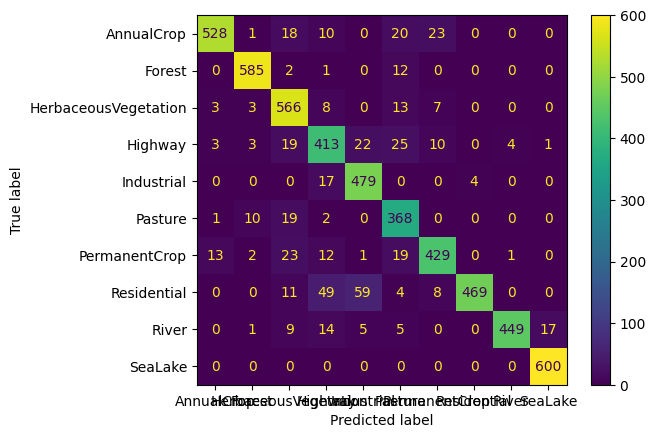

# EuroSAT_MS_Deep_Learning

 A project about making cutom dataloader for EuroSAT_MS database with variable size and training deep learning models

# About the Dataset

 EuroSAT_MS is a collection of 13 band images from the sentinel-2 EO sat, The image are 64x64 pixel in size and are divided between various classes. for more dertails visit the [EuroSAt](https://github.com/phelber/EuroSAT) github repo

A Euro_MS_Test_red dataset (1% of the original EuroSAT_MS) is provided in the data dir, for the training purpose, make sure to download EURO_MS dataset and store it in data dir

# dataset_load.ipynb

 This notebook contains codes to split the raw EuroSAT_MS data into test and train along woth size reduction according to the needs

# EuroSAT_CompVIS.ipynb

 Contains code to make custom dataset loaders for pytorch and a custom CNN network based on MiniVGG architecture along with saving the trined models

# test_models.ipynb and test_models_conf_mat.ipynb

Contains code to test the saved models and the conf_mat one also plots the confusion matrix. Two example confusion matrix for EuroSAT_M1_H39 model are given in results which achive a test accuracy of about 90%

